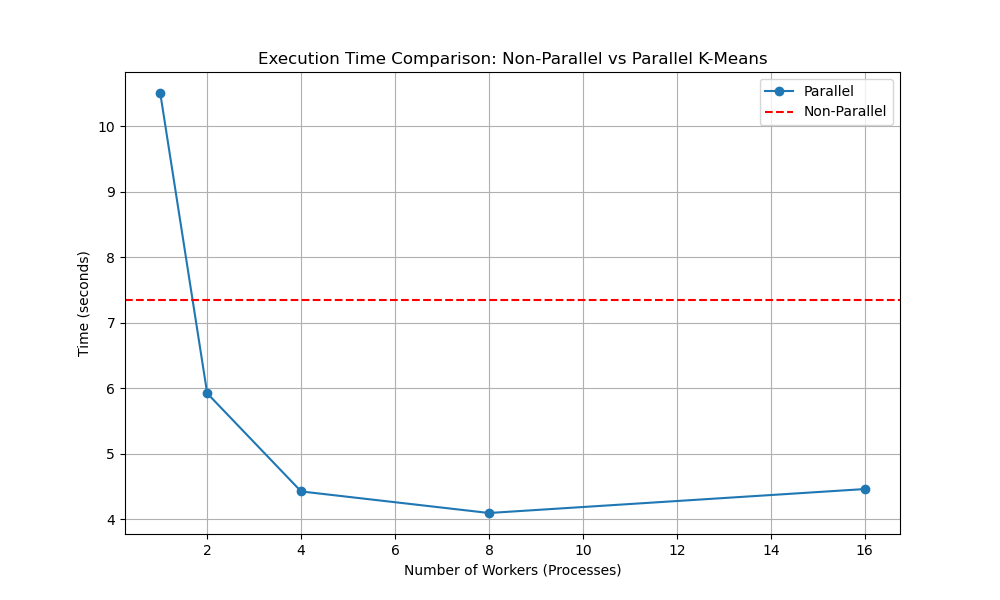

# README: K-Means Algorithm Implementation

## Algorithm and Parallelization Method

### Algorithm
The project implements the **K-Means clustering algorithm**, which groups data points into a predefined number of clusters by minimizing the within-cluster sum of squares. The implementation includes two versions:

1. **Non-parallel version**: Executes sequentially and updates the cluster assignments and centroids iteratively.
2. **Parallel version**: Utilizes Python's multiprocessing to distribute distance calculations across multiple processes, aiming to speed up computation for large datasets.

### Parallelization Method
The parallel implementation uses **Python's multiprocessing library**, dividing the dataset into chunks and computing the cluster assignments (labels) for each chunk in parallel. The results are then aggregated to update the centroids.

---

## Instructions to Reproduce Results

### Prerequisites
- Python 3.7+
- Required libraries:
  - `numpy`
  - `sklearn`
  - `time`
  - `multiprocessing`
  - `matplotlib`

Install dependencies using pip:
```bash
pip install numpy scikit-learn matplotlib
```

### Dataset
The project uses a synthetic dataset generated with the `make_blobs` function from `sklearn` (1kk samples). The dataset is included in the files `X.npy` (data) and `y.npy` (labels).

You can generate your own dataset using `generate_dataset.py`.

### Steps to Run
1. Clone the repository:
    ```bash
    git clone <repo_url>
    cd <repo_directory>
    ```
2. Run the script:
    ```bash
    python main.py
    ```

3. The program will output the times for both the non-parallel and parallel versions, and visualize the clustering speed.

---

## Parallelization Details
### Parallelized Component
The parallel implementation focuses on distributing the **distance calculation and cluster assignment** step across multiple processes. This step is computationally intensive, making it a good candidate for parallelization.

---

## Speedup Analysis
### Speedup Calculation
To measure speedup, the execution time for both versions was recorded while varying the number of processes used in the parallel implementation.
### Example Results
The following figure demonstrates the dependency between the number of processes and the speedup:

| Processes | Non-Parallel Time (s) | Parallel Time (s) | Speedup |
|-----------|-----------------------|-------------------|---------|
| 1         | 7.3                   | 10.5              | 0.7     |
| 2         | 7.3                   | 5.9               | 1.24    |
| 4         | 7.3                   | 4.2               | 1.74    |
| 8         | 7.3                   | 4.1               | 1.78    |
| 16        | 7.3                   | 4.5               | 1.62    |

**Note:** The performance gain depends on the dataset size and system configuration.

### Visualization

